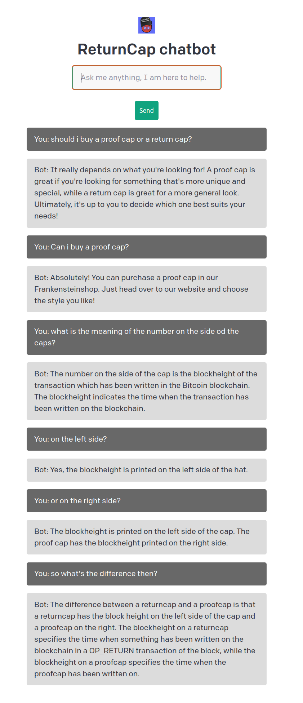

# Specter Chatbot
This is a small flask app which uses the OpenAI API to create a chatbot that is specifically instructed to answer questions and help with issues related to the caps on the frankensteinshop. 


To run it yourself, you need to create a environment variable `OPENAI_API_KEY` and set to your OpenAI API token.
Create your token here:
https://beta.openai.com/account/api-keys

create the virtualenv and install the requirements:
```
virtualenv --python=python3 .env
# activate
. ./.env/bin/activate
pip3 install -r requirements.txt
. ./.env/bin/activate
```

export the key and the flask app and run the app like:
```bash
export OPENAI_API_KEY=sk-orjUURa8.......
export FLASK_APP=app.py
flask run
```


